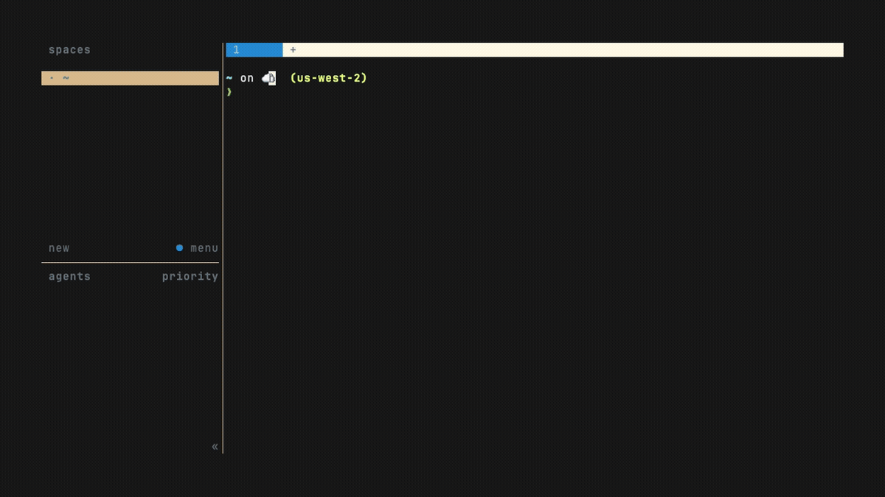

# sniffr

An AI **sniffs your PR for issues before you review it**. Point `sniffr` at a
GitHub pull request: it opens the PR in [tuicr](https://tuicr.dev), then an AI
agent reviews the diff **in the background** and drops its findings in as draft
review comments — so by the time you start reading, the risky lines are already
flagged. Agent-agnostic (Codex, Claude, Cursor, Grok, opencode, ollama).



Part of a terminal PR-review workflow on [herdr](https://herdr.dev); pairs with
[herdr-pickr](https://github.com/tomasvarga/herdr-pickr) (add it as a `[[backend]]`).

> **sniffr never posts to GitHub.** Every comment is a tuicr **local draft** on
> your machine — you read them, prune the noise (`dd` / `:clearc`), and submit
> what's left yourself. The AI's pass is private scaffolding for *you*, never
> something the PR author sees unless you choose to send it.

> Status: early (v0.1). macOS + GitHub tested; Linux date handling supported.

Run `sniffr doctor` first — it checks deps, herdr, `gh` auth, your agent, and
notifications, and tells you exactly what's missing.

## How it works

```
sniffr <pr>
  → tuicr opens the PR (in a herdr split) — you start reading immediately
  → a detached worker runs your agent over the diff
  → findings injected as tuicr LOCAL-DRAFT comments (never pushed)
  → the pane reloads; a notification fires when done
```

## Install

```bash
git clone https://github.com/tomasvarga/sniffr ~/Documents/GitHub/sniffr
~/Documents/GitHub/sniffr/install.sh     # symlinks bin/sniffr into ~/.local/bin
```

## Usage

```bash
sniffr <pr>                 # number | owner/repo#N | URL   (run from a herdr pane)
sniffr <pr> --agent grok    # one-off agent override
sniffr <pr> --backend hunk  # deliver findings to hunk instead of tuicr
sniffr --set-agent grok     # save the default agent (--show-agent prints it)
sniffr queue                # pick from the PRs actually awaiting your review
sniffr doctor               # preflight: deps, herdr, gh auth, agent, backend
```

Pick the agent (first match wins): `--agent` flag · `SNIFFR_AGENT` env · saved
default (`~/.config/sniffr/agent`) · `codex`. Built-ins: **codex · claude ·
cursor · grok · opencode · ollama**. Any other tool via `SNIFFR_CMD='<command>'`
(gets the review prompt on stdin, must print a JSON array of findings). Findings
are stamped with the agent name so they're distinct from yours; in tuicr `dd`
drops one, `:clearc` clears all.

### Backends — where the findings go

sniffr's core (diff → agent → line-anchored findings) is backend-agnostic; a
**backend** decides how they're presented. Pick one (first match wins):
`--backend` flag · `SNIFFR_BACKEND` env · `backend =` in
`~/.config/sniffr/config.toml` · **`tuicr`** (default).

- **`tuicr`** (built-in, default) — opens `tuicr pr`, injects local-draft
  comments into the live session, reloads.
- **`hunk`** ([hunk.dev](https://hunk.dev), built-in) — opens `hunk patch`,
  injects into the live hunk session via its comment API. Same async model.
- **custom** — define your own reviewer in `config.toml`. sniffr resolves the
  findings, then runs your `open` command (launch the viewer in a split) and
  pipes the findings JSON to your `inject` command:

  ```toml
  # ~/.config/sniffr/config.toml
  backend = "tuicr"          # the default when --backend / env aren't set

  [backends.myreviewr]
  open   = "myreviewr open {url}"   # {url} {repo} {num} {diff} {pane}
  inject = "myreviewr import --stdin"
  ```

  This is how any other review tool (e.g. herdr-reviewr) plugs in without sniffr
  hardcoding its API. See [`config/config.example.toml`](config/config.example.toml).

### `sniffr queue` — pick from your review list

Instead of pasting a URL, ask GitHub what's waiting on you and pick from a menu:

```bash
sniffr queue                # menu of PRs awaiting your review → pick → sniff it
sniffr queue --agent grok   # …and use grok on whatever you pick
```

It runs one `gh search` for open PRs where you're a requested reviewer (across
**all** your repos — no checkout), then filters to what actually matters by
default:

- **no bots** — drops Dependabot/Renovate dependency bumps
- **no drafts** — skips WIP
- **recent only** — activity in the last **3 weeks** (buries stale/dangling
  review requests)

Arrow keys / number to select, `q` to cancel. Picking a PR runs the normal
`sniffr <pr>` path on it — so `queue` is purely a target-picker and never
diverges from the manual flow. Dials for when the defaults are wrong:

```bash
sniffr queue --since 2mo    # widen the activity window (21d|3w|2mo|1y)
sniffr queue --all          # the full list: bots + drafts + no date cutoff
sniffr queue --include-bots # add bots back
sniffr queue --drafts       # add drafts back
```

## Requirements

**herdr ≥ 0.7.0**, `gh` (authenticated), `jq`, `python3` (≥3.11 for config), and
at least one **agent CLI** (codex/claude/cursor/grok/opencode/ollama) on your
`PATH`. Plus the binary for your backend: **tuicr** (default) or
**[hunk](https://hunk.dev)**. Runs from inside a herdr pane. GitHub only for now.
macOS and Linux (`sniffr doctor` verifies all of the above).

## Limitations

- **herdr + tuicr required** (v0.1) — sniffr opens tuicr in a herdr split and
  reloads it. (A herdr-optional mode is a possible future direction.)
- **Line anchoring** is by content: the agent quotes the exact line, and sniffr
  parses the diff to resolve the real new-side line number (the agent's own count
  is only a tiebreaker). A quote that can't be matched becomes a file-level comment.
- Comments are **local drafts** — never pushed until you submit them in tuicr.
- **Re-running duplicates comments.** sniffr appends; it doesn't dedup against a
  previous pass (tuicr has no CLI to remove drafts). Prune in the TUI — `dd` drops
  one, `:clearc` clears all — before re-sniffing the same PR.

## License

MIT — see [LICENSE](LICENSE).
